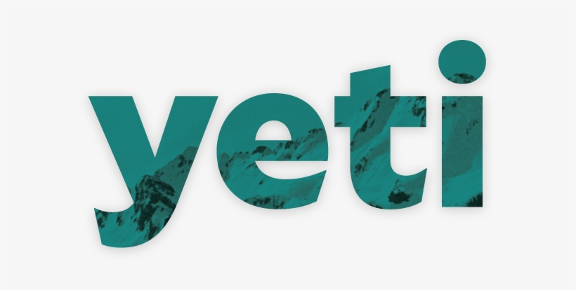

<p align="center">
  <!--  -->
  <!--  -->
  <!--  -->
  
  <br />
  YETI - Angular Starter Kit
  <br /><br />

  <a href="http://commitizen.github.io/cz-cli/">
    
  </a>
  <a href="https://github.com/semantic-release/semantic-release">
    
  </a>
  <a href="https://renovatebot.com/">
  
  </a>
  <a href="https://github.com/xmlking/yeti/blob/develop/LICENSE">
    
  </a>

  <br /><br />

  <a href="https://lgtm.com/projects/g/xmlking/yeti/alerts/">
  
  </a>
  <a href="https://lgtm.com/projects/g/xmlking/yeti/context:javascript">
  
  </a>
</p>

---
YETI is a Lorem ipsum dolor sit amet, consectetur adipiscing elit, sed do eiusmod tempor incididunt ut labore et dolore magna aliqua. Ut enim ad minim veniam, quis nostrud exercitation ullamco laboris nisi ut aliquip ex ea commodo consequat. Duis aute irure dolor in reprehenderit in voluptate velit esse cillum dolore eu fugiat nulla pariatur. Excepteur sint occaecat cupidatat non proident, sunt in culpa qui officia deserunt mollit anim id est laborum.

## 🚀 Quick Links

- Checkout the [Demos](https://ngx-starter-kit.firebaseapp.com/)
- Learn more in the [GitBook](https://xmlking.gitbook.io/yeti/v/develop/)
- API Docs [CompoDoc](https://xmlking.github.io/yeti/)
- Learn about updates from the [changelog](CHANGELOG.md)

## ✨ Features

## 📦 Install

## 🔭 Development

### API

```bash
# Start API
ng serve api
# Start Envoy proxy
docker-compose up envoy
```

### WebApp

```bash
## gen i18n
ng xi18n webapp
## serve
ng serve webapp --configuration=es
ng serve webapp --configuration=hi
## build
ng build webapp --configuration=hi
# You can also build the app with a specific locale:
ng build webapp --configuration=production,es
# build all
ng build --localize
ng build --prod --localize
```

### Deploy

Run `ng deploy` to deploy demo app to firebase.

Analyzing bundle size `yarn bundle-report`

### NX

```bash
# To run these tasks you run:
nx run <project-name>:<task-name>
# To run a task for all affected projects use:
nx affected --target=<task-name>
nx run <project-name>:doc
nx affect --target=doc

ng run webapp:doc
# gen meta
# node tools/scripts/metagen.mjs
yarn gen:metadata
```

## 🔗 Credits