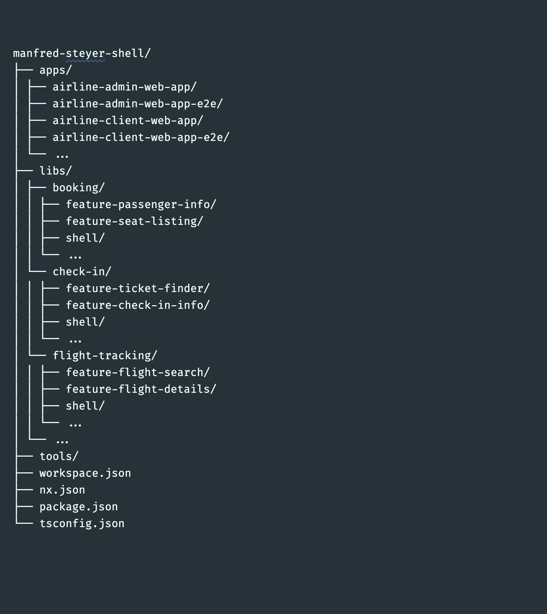

# Monorepo

`Monorepo` encourages developers to split monolith codebase into microservices and micro-apps,
and manage them in single repository so that we can effortlessly keep all sub-modules in sync with consistent dependencies and versions.
Developer can share code via `lib` modules.

## Concepts

### What's Domain Driven Design about?

DDD describes an approach that bridges the gap between requirements for complex software systems on the one hand and a appropriate application design on the other. It can be subdivided into the disciplines Tactical Design and Strategic Design. The former proposes concrete concepts and patterns for an object-oriented design respective architecture. It has an opinionated view on using OOP. As an alternative, there are approaches like Functional Domain Modeling that transfer the ideas behind it into the world of functional programming.

By contrast, strategic design deals with the breakdown of a large system into individual (sub-)domains and their design. No matter if you like DDD's opinionated view or not, some ideas from Strategic Design have proven to be useful for subdividing a system into smaller, self-contained parts

## Workspace

### Project structure

> Shell Library patterns with Nx and Monorepo Architectures

   
  Figure 2. Manfred Steyer shell libraries. Made with https://creately.com

## References

  - [Shell Library patterns with Nx and Monorepo Architectures](https://indepth.dev/the-shell-library-patterns-with-nx-and-monorepo-architectures/)
  - [nx-ddd-plugin](https://github.com/angular-architects/nx-ddd-plugin/tree/master/libs/ddd)
    - [ddd-demo](https://github.com/angular-architects/ddd-demo)
